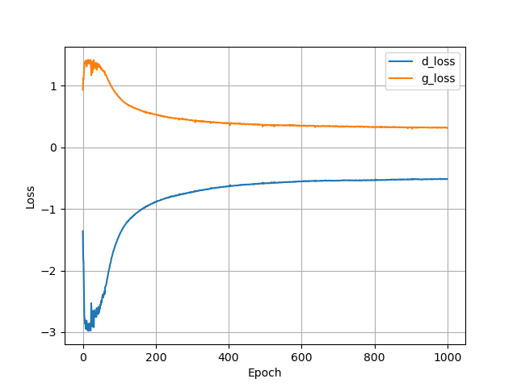
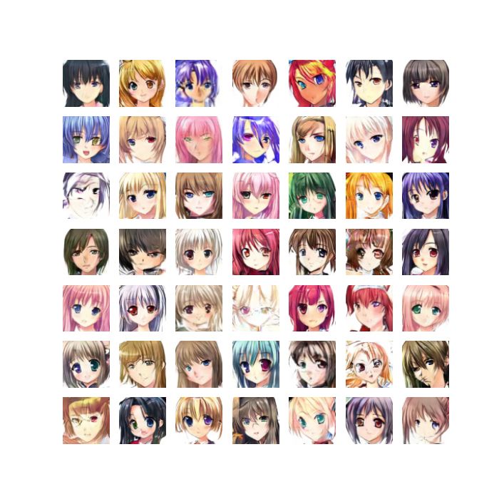

# GAN
$$\min\limits_{G}\max\limits_{D}V(G,D) = E_{x\thicksim p_{data}(x)}[log(D(x))] + E_{z\thicksim p_z(z)}[log(1 - D(G(z)))]$$

>由于原始GAN中的损失函数在最优判别器条件下，损失函数等价于数据真实分布 $P_{data}$ 和生成器分布 $P_{g}$ 的JS散度，又由于数据分布是高维空间中的低维流形， $P_{data}$ 和 $P_{g}$ 不重叠，导致JS散度是常数从而无法训练（梯度消失）。

$$
\min\limits_{G}\max\limits_{D}V(G,D) = E_{x\thicksim p_{data}}[log(D(x))] + E_{x\thicksim p_g}[-log(D(x)]
$$

>对于第二种形式的损失函数，在最优判别器下等价于既要最小化 $P_{g}$ 与 $P_{data}$ 的KL散度，又要最大化其JS散度，相互矛盾，导致梯度不稳定，而且KL散度的不对称性使得生成器宁可丧失多样性也不愿丧失准确性，导致collapse mode现象.

# WGAN
$$
W(p_g,p_r) = \inf_{\gamma\in\prod}E_{(x^g,x^r)\thicksim\gamma}||x^g,x^r||
$$

>Wasserstein距离相比KL散度、JS散度的优越性在于,即便两个分布没有重叠,Wasserstein距离仍然能够反映它们的远近。

$$
K\cdot W(p_g,p_r) \approx \sup\limits_{f\in 1-Lipschitz}E_{x\thicksim p_r(x)}[f_w(x)]-E_{x\thicksim p_g(x)}[f_w(x)]
$$

-  $f_w(x)$ 要满足K-利普希茨条件.因此在W-GAN中,使用了一种简单的**权重裁剪**(weight clipping)策略

**Algorithm guidelines for stable GANs**  

* No log in the loss. The output of D is no longer a probability, hence we do not apply sigmoid at the output of D
* Clip the weight of D (0.01)

# Results
## loss

## process

## result

# References
[1] Wasserstein GAN  
[2] https://github.com/luzhixing12345/Anime-WGAN/

