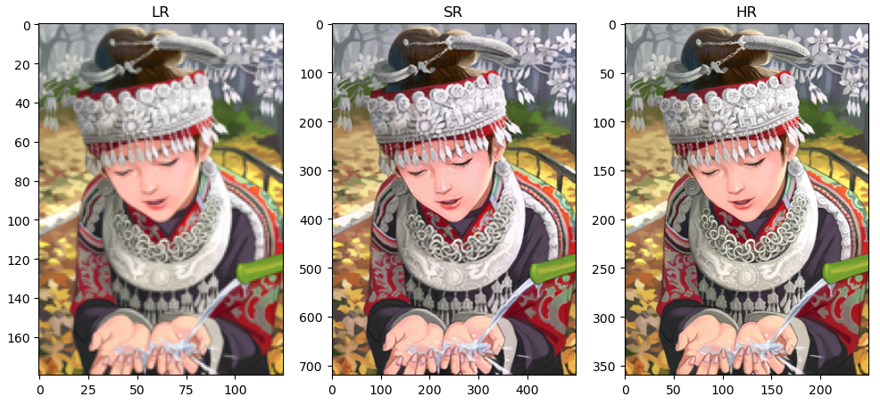

# DeepLearning
## Single image super-resolution(SISR)
### SRCNN
Ref: Image Super-Resolution Using Deep Convolutional Networks
### SRGAN
Ref: Photo-Realistic Single Image Super-Resolution Using a Generative Adversarial Network

## Image Generation
### GAN
Ref: Generative Adversarial Nets
### DCGAN
Ref: Unsupervised representation learning with deep convolutional generative adversarial networks
### WGAN
Ref: Wasserstein GAN

## Instance Segmentation
### Mask R-CNN
## Multi Object Tracking
### SORT
# MachineLearning
### AdaBoost
### DBSCAN
### GMM
### PCA
### k-means
### LVQ
### LDA
### LR
### naive-bayes
### MLP
### SVM
# Python
## data_visualization
## pandas
## numpy
## matplotlib
