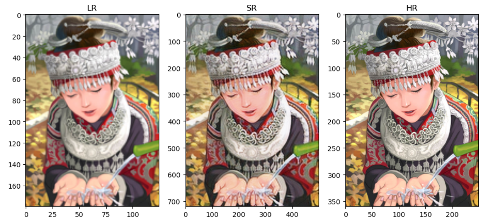

# Single-Image Super-Resolution
## SRGAN
##### 对比原文所做修改
1. 生成器损失添加一图片损失
2. 内容损失为VGG16第31特征层的MSE
3. 借助WGAN的思想去除生成器和判别器对抗损失中的log，防止梯度消失
4. 生成器最后用一tanh激活函数限制卷积层输出范围
### dataset: DIV2K
#### Epochs = 100, loss:

#### result:

#### Epochs = 1200, loss:

#### result:

